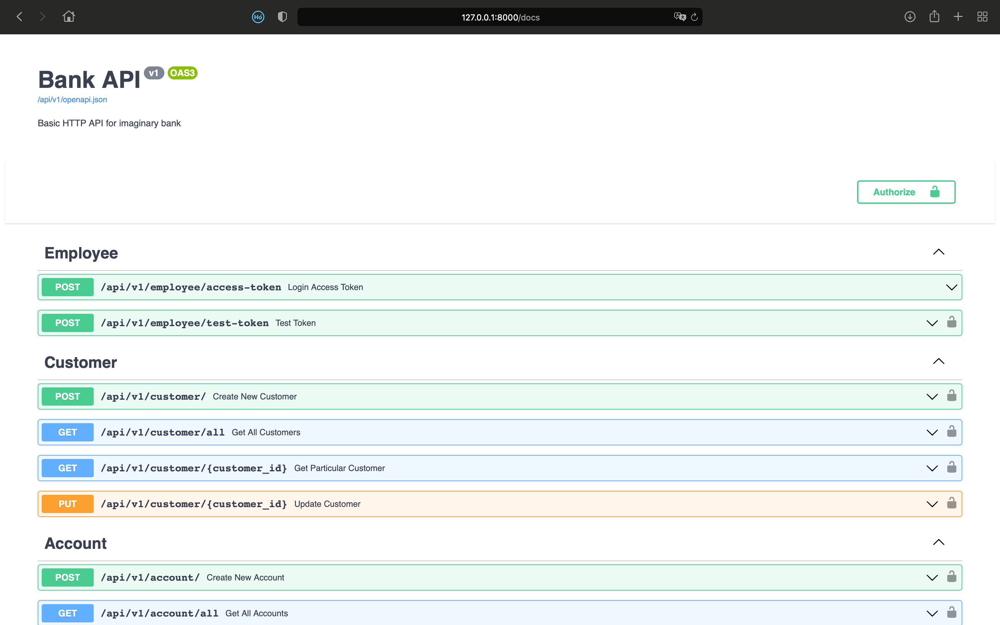

### Objective

Your assignment is to build an internal API for a fake financial institution using Python and any framework.

### Brief

While modern banks have evolved to serve a plethora of functions, at their core, banks must provide certain basic
features. Today, your task is to build the basic HTTP API for one of those banks! Imagine you are designing a backend
API for bank employees. It could ultimately be consumed by multiple frontends (web, iOS, Android etc).

### Tasks

- Implement assignment using:
    - Language: **Python**
    - Framework: **any framework except Django**
- There should be API routes that allow them to:
    - Create a new bank account for a customer, with an initial deposit amount. A
      single customer may have multiple bank accounts.
    - Transfer amounts between any two accounts, including those owned by
      different customers.
    - Retrieve balances for a given account.
    - Retrieve transfer history for a given account.
- Write tests for your business logic

Feel free to pre-populate your customers with the following:

```json
[
  {
    "id": 1,
    "name": "Arisha Barron"
  },
  {
    "id": 2,
    "name": "Branden Gibson"
  },
  {
    "id": 3,
    "name": "Rhonda Church"
  },
  {
    "id": 4,
    "name": "Georgina Hazel"
  }
]
```

You are expected to design any other required models and routes for your API.

### Evaluation Criteria

- **Python** best practices
- Completeness: did you complete the features?
- Correctness: does the functionality act in sensible, thought-out ways?
- Maintainability: is it written in a clean, maintainable way?
- Testing: is the system adequately tested?
- Documentation: is the API well-documented?

# Bank API backend

## Backend Requirements

* [Docker](https://www.docker.com/).
* [Docker Compose](https://docs.docker.com/compose/install/).
* [Poetry](https://python-poetry.org/) for Python package management.

### The .env file

The `.env` file is the one that contains configurations, generated keys and passwords, etc.

The file should be in the root of the project, you can use `.env-sample` file as a template.

### Run tests

To run tests using docker-compose use following self-contained command:

```bash
# requires .env file
docker-compose -f docker-compose.test.yml up --abort-on-container-exit --remove-orphans
```

To run tests locally:

```bash
poetry install --no-root
# requires test postgres instance and .env file
sh scripts/test.sh
```

### Start the project

You can start API server and db instance using docker-compose with the following self-contained command:

```bash
docker-compose up --remove-orphans
```
The server will appear at http://0.0.0.0:5000

to start server locally:

```bash
poetry install --no-root --no-dev
# requires test postgres instance and .env file
sh scripts/entry_point.sh
```

### Migrations

Project uses `SQLAlchemy` as ORM and `alembic` for migration automation.

To install the latest migration, simply run:

```bash
PYTHONPATH=. poetry run alembic upgrade head
```

### API documentation



You can use http://0.0.0.0:5000/docs or http://0.0.0.0:5000/redoc to access full spec Open API interactive documentation. 

You can access json formatted API schema via http://0.0.0.0:5000/api/v1/openapi.json


### Security

The api backend requires JWT Bearer token in request header to authorize access to the methods. The database is populated with initial employee on the first start of the server. Use `FIRST_EMPLOYEE` and `FIRST_EMPLOYEE_EMAIL` to get access token via `/api/v1/employee/access-token`. Then you can set token for access using green **Authorize** button in interactive documentation.  


### End note

If you have any questions you can contact me on telegram @indionapolis